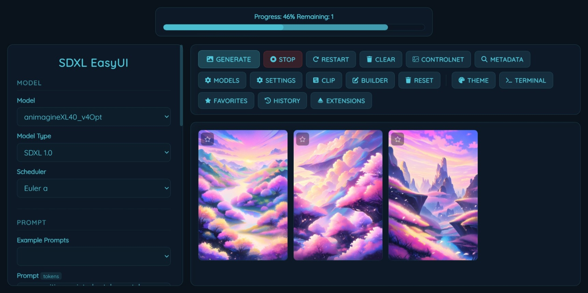

<div align="center">



# EasyUI V2.7.5
</div>
> A free, open-source local text-to-image generation UI — run advanced AI models on your own hardware with full parameter control.

<div align="center">

[](https://github.com/umittadelen/stableDiffusionEasyUI/blob/main/LICENSE.txt)


</div>

> [!NOTE]
> The `git clone` version is always more up-to-date than the official releases, but may be unstable and does not include embedded Python.

---


## What's New in V2.7.5

- fixed image-wrapper width breaking in some cases
- added max_batch_size and batched_generation settings
- vae tiling/slicing now enabled for SDXL models if supported by the implementation, This should *Hopefully* reduce VRAM usage for large batch sizes on VRAM-limited GPUs.
- latents now deattached, cloned, and moved to CPU before being saved to the generation queue, which should prevent any GPU memory leaks related to latent image saving.
- seed increases by 1 for each image in the batch when batch size > 1, to ensure different images in the batch instead of identical copies.
- added if check for if the config host matches the local IP address, and warn the user if it doesn't *since it stops the server immediately*.

<details>
<summary>

## Previous Versions</summary>

**V2.6.4**

- **Latents Color Handling Improved** — Latent-to-image color conversion is now more accurate and robust. Latent image saving is now handled in a background thread/queue for better performance and stability.
- **Consistent Strength Range** — The `strength` parameter for img2img now uses the same 0.0–1.0 range as ControlNet, making parameter behavior consistent across modes.
- **Image Metadata Fixes** — Improved and fixed image metadata saving, ensuring prompt and generation details are correctly embedded in PNGs.


**V2.6.2**

- start.bat file changed with start.exe for easier launching

**V2.6.1**

- **Settings Page Redesign** — The Settings page now uses a modern, glassmorphic multi-column grid layout. Settings are grouped into cards, with a responsive grid that adapts to any screen size. The layout is visually consistent with the rest of the UI and supports unlimited columns on wide screens.
- **True Responsive Grid** — The settings grid now expands to as many columns as fit the viewport, with no artificial column or width limit. On smaller screens, it stacks vertically for mobile usability.
- **Consistent Glassmorphism** — All settings cards use the same glassmorphism style as the rest of the app, with uniform padding and spacing.
- **No More Layout Inheritance Issues** — The settings page no longer inherits the main page's grid layout, ensuring the settings grid always behaves as intended.
- **General UI/UX Polish** — Improved spacing, heading alignment, and responsive behavior for a more professional look and feel.

**V2.6.0**

- **Model Manager Overhaul** — The Model Editor page now features a modern card-based UI, with preview images, glassmorphic modal editing, and robust model add/edit/delete logic. No more raw JSON editing!
- **Safer Model Deletion** — Deleting a model now requires confirmation, preventing accidental removals.
- **Persistent Download Status** — Model download status messages now persist after page refresh, so you always know what's happening.
- **Improved Feedback** — Downloading a model shows a non-blocking status message instead of a popup, for a smoother experience.
- **UI/UX Polish** — Model cards are visually improved, with images aligned to the left and details to the right for a cleaner look.
- **General bug fixes and UI polish** — Various UI/UX improvements, more consistent dropdowns, and minor fixes throughout the app.

**V2.5.6**

- **Image Gallery Improvements** — The gallery now supports any number of images per row, with a responsive horizontal auto-grid. The previous hardcoded display limit of 4 has been removed. Layout is more flexible and adapts to your chosen value.
- **UI Consistency** — Gallery and image scaling are now more robust, with improved CSS grid handling and better responsiveness across devices.
- **General bug fixes and UI polish** — Various UI/UX improvements, more consistent dropdowns, and minor fixes throughout the app.

**V2.5.5**

- **New Terminal extension** — Live server output (stdout + stderr) viewable directly in the UI via a new action bar button.
- **Favorites extension** — Star images to save as favorites, with robust UI, persistent storage, and improved hover/interaction effects.
- **Theme system improvements** — More robust theme loading and error handling for custom UI colors and backgrounds.
- **Extension system improvements** — Improved isolation for extension CSS/JS, more reliable Extension Manager, and better extension load order handling.
- **General bug fixes and UI polish** — Various UI/UX improvements, more consistent dropdowns, and major fixes throughout the app.

**V2.4.1**

- **Unified custom dropdown UI** — Example Prompts, Styles, and Sizes now use a consistent, modern custom dropdown for improved UX.
- **Improved extension isolation** — Extension CSS and JS are more robust against global overrides, ensuring reliable UI behavior.
- **Favorites extension improvements** — Star icons are robustly injected, sized correctly, and have enhanced hover effects. User favorites are stored in a gitignored config file.
- **General** — Extension Manager, Image History, Booru Tag Helper, and Glass blur control as in previous versions.

**V2.3.1**
- **Extension Manager** — Built-in manager at `/extension_manager/` to enable/disable extensions, control load order with ▲/▼ buttons, and clone new extensions directly from a Git URL. The manager itself is always loaded first and cannot be disabled.
- **Image History extension** — Every generated image is automatically copied to a persistent history that survives **Clear**. Gallery UI with search, infinite scroll, and per-image delete. Clicking an image opens the existing metadata viewer.
- **Booru Tag Helper extension** — Live tag autocomplete in the prompt and negative prompt fields. Queries the Danbooru API as you type and shows suggestions sorted by post count. Keyboard navigable (↑/↓, Enter/Tab, Escape).
- **Glass blur control** — `--glass-blur` CSS variable is now adjustable via a slider in the Theme Customizer (0–40px).

**V2.2.1**
- **Theme Customizer extension** — New built-in extension to set a custom background image or solid color, with overlay tint color and opacity controls. Colors for all three UI tones are adjustable via color pickers. Settings persist in `settings.json` and are applied instantly on every page load.
- **Extension action bar buttons** — Extensions can now register a button in the main action bar via `window.registerExtensionButton(label, url, icon)`, making extension UIs directly accessible from the main page.

**V2.2.0**
- **Async NSFW scoring** — Scores are computed in a background thread after generation and persisted in PNG metadata and server cache. The `/status` response includes `nsfw_score` per image so blurring applies immediately without blocking generation.
- **NoobAI model support** — NoobAI is now available as a selectable model type in the UI.
- **Improved exception handling** — Manual stops no longer produce misleading error messages. The generator checks `generation_stopped` before setting error status, preventing duplicate or incorrect updates.

</details>

---

## Features

| Feature | Description |
|---|---|
| Progress Tracking | Real-time generation progress |
| Seed Control | Reproducible or randomized outputs |
| CFG Scale | Control how closely the AI follows your prompt |
| Multiple Schedulers | Choose from various sampling schedulers (default: Euler A) |
| ControlNet | Canny/Depth fully supported; Normal Map for SD only |
| Img2Img & Txt2Img | Both generation modes supported |
| NSFW Blur | Auto-detects and blurs NSFW content in the gallery (hover to reveal) |
| Mobile Layout | Responsive UI that works on small screens |
| Extension System | Drop a folder into `extensions/` to add new features |
| Extension Manager | Enable/disable extensions, set load order, clone from Git URL |
| Theme Customizer | Custom background image, solid color, overlay tint, UI colors, and glass blur |
| Image History | Persistent image gallery that survives Clear, with search and metadata viewer |
| Booru Tag Helper | Autocomplete booru-style tags in prompt fields, sorted by post count |
| Drop to Fill | Drag & drop any EasyUI-generated image to restore its generation parameters |

---

## Requirements

- A CUDA-capable NVIDIA GPU
- [CUDA Toolkit](https://developer.nvidia.com/cuda-downloads)
- Python 3.10+ (or use the bundled embedded Python)

---

## Installation
1. Clone the repository:
    ```bash
    git clone https://github.com/umittadelen/stableDiffusionEasyUI.git
    cd stableDiffusionEasyUI
    ```
2. Run `start.exe`. Dependencies are installed automatically on first launch.

3. The server must start at `http://localhost:8080` by default. The host and port can be changed from the Settings page.

---

## Usage

### 1. Download a Model

Open the **Model Editor** and enter a CivitAI model ID and version ID (found in the `AIR` field on the model page, e.g. `AIR: 123456 @ 654321`).

### 2. Configure Parameters

| Parameter | Description |
|---|---|
| Model Type | SD1.5 / SDXL / FLUX / NoobAI — auto-set when using Model Editor |
| Scheduler | Sampling scheduler (default: Euler A) |
| Prompt | Describe the image. Avoid very short prompts. Use `prompt1§prompt2` for multi-prompt. |
| Negative Prompt | Describe what to exclude from the image |
| Width / Height | Output image dimensions |
| CFG Scale | Prompt adherence strength |
| Sampling Steps | Number of denoising steps (30 recommended) |
| Seed | Set to `-1` for random variation |
| Batch Size | Number of images to generate |

> [!TIP]
> See the [Better Prompting Guide](https://umittadelen.github.io/better_prompting/) for tips on writing effective prompts.

### 3. Generate

Click **Generate Images** to start. Use **Stop Generation** to cancel at any time.

---

## Extensions

Extensions live in the `extensions/` folder. Each extension is a folder containing an `__init__.py` with a `setup(app, gconfig, hooks, api)` function.

### Built-in Extensions

| Extension | URL | Description |
|---|---|---|
| Extension Manager | `/extension_manager/` | Enable/disable extensions, set load order, clone from Git |
| Theme Customizer | `/theme_customizer/` | UI colors, background image, glass blur |
| Image History | `/image_history/` | Persistent image gallery with search |
| Booru Tag Helper | *(injects into prompt fields)* | Live tag autocomplete from Danbooru |

### Installing Extensions

Open the **Extension Manager** and paste a Git URL in the format `https://github.com/user/repo.git`. The extension will be cloned into `extensions/` and loaded on the next server restart.

> [!WARNING]
> Extensions run arbitrary Python code on your machine. Only install extensions from sources you trust.

### Extension Load Order

The Extension Manager always loads first. All other extensions load in the order shown in the manager UI — drag with ▲/▼ buttons to reorder. Order is saved to `extensions/order.json`.

### Disabling Extensions

Toggle any extension on or off in the Extension Manager. Disabled extensions are listed in `extensions/disabled.json` and skipped on startup. Changes take effect after restarting the server.

---

## Additional Tools

- **Clear Images** — Remove all images from the current gallery session
- **Preview ControlNet** — Preview the ControlNet preprocessor output before generating
- **Get Metadata** — Extract generation parameters from any EasyUI PNG
- **Model Editor** — Download and manage models via CivitAI IDs

---

## License

MIT License — see [LICENSE.txt](https://github.com/umittadelen/easyUI/blob/main/LICENSE.txt) for details.

---

Made by [umittadelen](https://umittadelen.net/)

---

### More About Me
[www.umittadelen.net](https://umittadelen.net)
